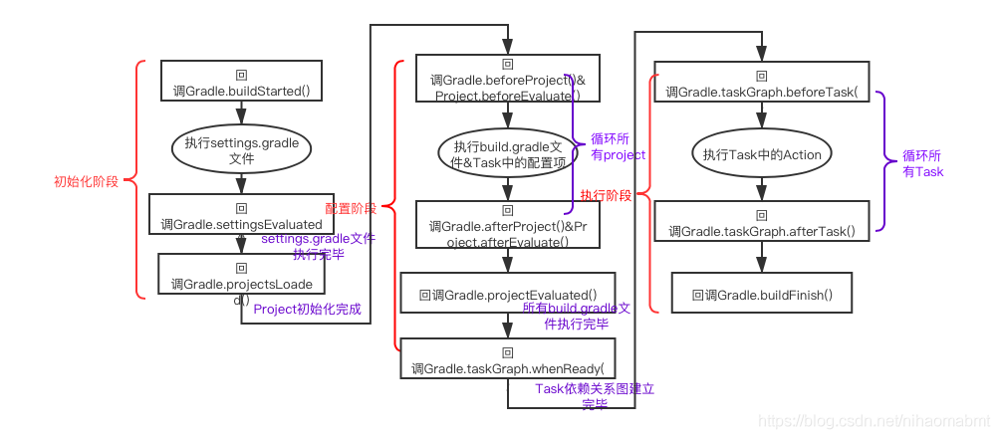

# android-gradle-demo

Groovy/Gradle练习

# Gradle构建项目的三个阶段

1. 初始化阶段：创建Project对象
2. 配置阶段：创建Project下的Task
3. 执行阶段：执行Task

* **gradle构建过程回调** (对于该Gradle构建过程的监听事件，需要放到settings.gradle文件中)
> 

[Task参考](https://docs.gradle.org/current/dsl/org.gradle.api.Task.html)
